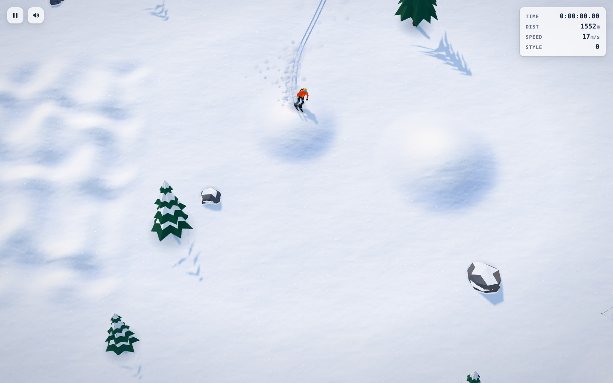
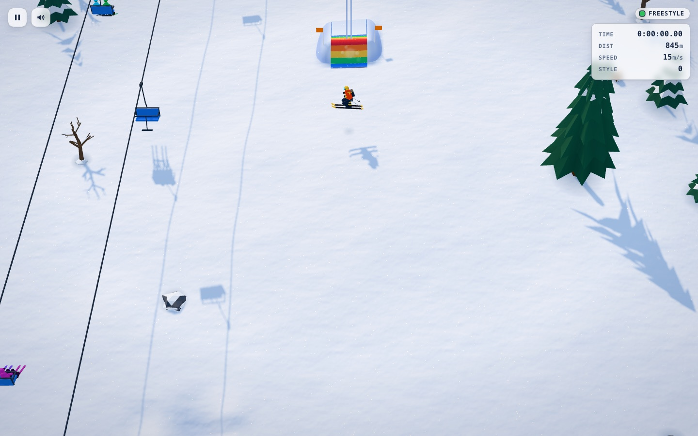
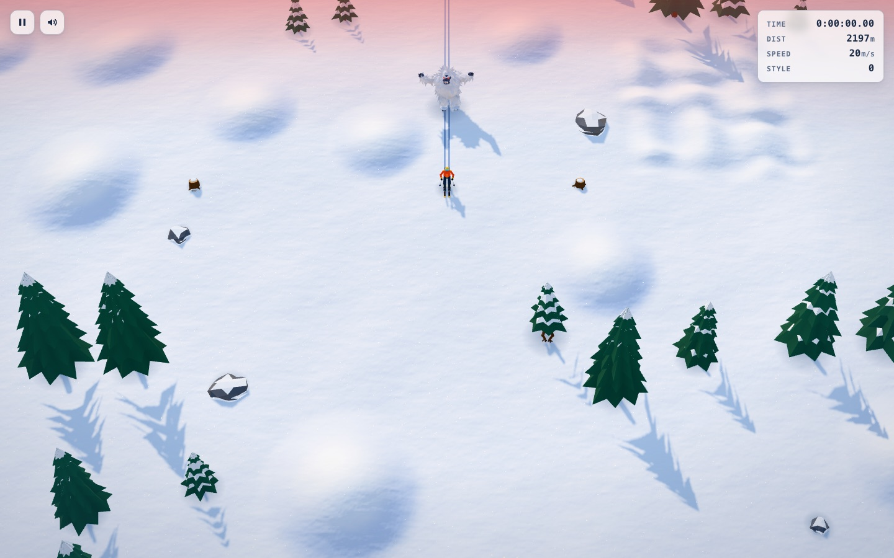

# SkiFree 3D

**▶ Play: https://steveoscar.github.io/skifree-3d/**

A modern real-time 3D remake of SkiFree, the 1991 Windows game. Ski downhill, dodge trees, rocks and other skiers, fly
off jumps, run the three courses, and sooner or later meet the Abominable Snow Monster.

The gameplay stays close to the original, with realistic physics layered on top: momentum and gravity on the slope,
carving versus skidding, air drag, ballistic jumps with graded landings, and tumbling crashes. Everything is drawn in
real time with [Three.js](https://threejs.org/). The whole game is one self-contained HTML file that makes no network
requests.

| | |
|---|---|
|  |  |

## Controls

**On the snow**

| Keys | Action |
|---|---|
| ← / → (A / D) | Steer: tap for the next 30° notch, hold to carve. Push past sideways to edge to a stop. |
| ↓ (S) | Point downhill; hold to tuck, or skate when slow |
| ↑ (W) | Hockey stop; walk uphill once stopped |
| Shift+← / Shift+→ | Skid to a stop across the hill |
| Space | Ollie (also pops a jump's lip) |
| Shift+Space | Small hop |

**In the air** (big jumps only; tap just before the lip to queue a trick)

| Keys | Trick |
|---|---|
| ← / → | Helicopter: a full 360° spin |
| ↓ / ↑ (or a mouse click) | Head-over-heels: front / back flip |
| Space (hold) | Backscratcher; let go before you land |

**Mouse and touch:** point to steer; point level with or above the skier to stop; click to ollie. On touch screens, drag
toward where you want to go and tap to ollie.

**System keys:** R or F2 restart, P or F3 pause, M sound, H help, and lowercase `f` for turbo (the original's secret
fast mode).

## Modes

- **Free ski:** an endless mountain.
- **Slalom:** pass red flags on their left and blue flags on their right. Each missed gate adds 5 s.
- **Tree Slalom:** a longer, tighter slalom through the trees.
- **Freestyle:** style points for jumps and tricks. Set the dead tree on fire, then jump it.

Pick a course from the title screen, or ski through its start banners at the top of the mountain, just like the
original. Best times and scores are saved in your browser.

## The yeti

Somewhere past 2000 m, something is waiting. It chases a little faster than you ski, so keep moving.

## Credits

A tribute to SkiFree © 1991 Chris Pirih. This project is not affiliated with or endorsed by Microsoft or Chris Pirih.

Built with Three.js (MIT License); see [THIRD_PARTY_NOTICES.md](THIRD_PARTY_NOTICES.md).
